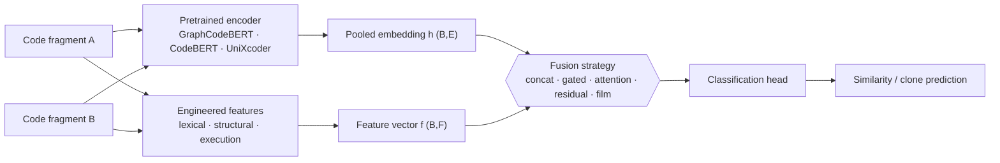
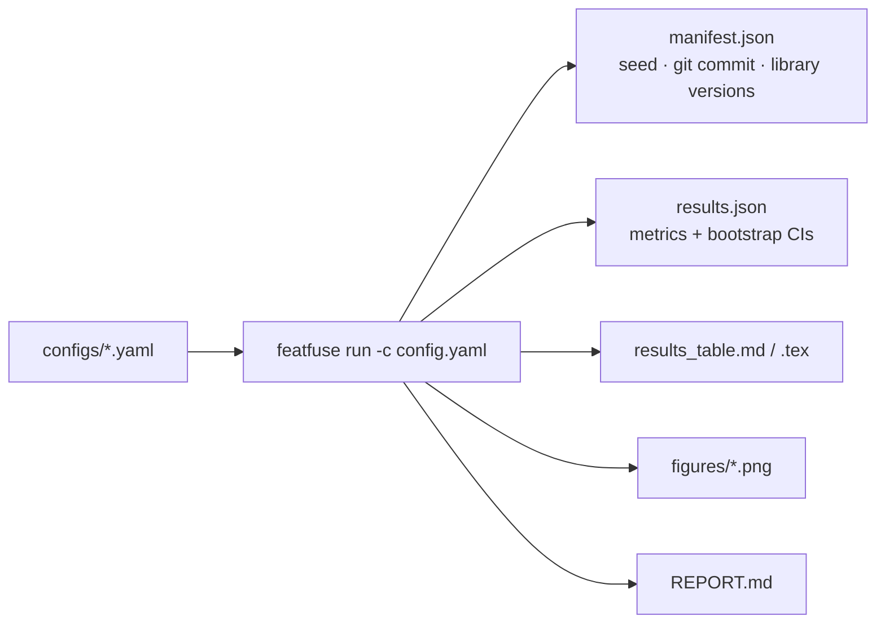

<div align="center">

# FeatFuse: Feature Integration for Code Language Models

### An open, reproducible benchmark for augmenting GraphCodeBERT (and CodeBERT, UniXcoder, …) with engineered features

*Does adding hand-crafted lexical, structural, and execution-based features to a pretrained code transformer actually help? FeatFuse lets you measure it, reproducibly, with one command.*

[](https://github.com/jorge-martinez-gil/graphcodebert-feature-integration/actions)
[](https://opensource.org/licenses/MIT)
[](https://www.python.org/)
[](https://arxiv.org/abs/2408.08903)
[](#citation)

[](https://github.com/jorge-martinez-gil/graphcodebert-feature-integration/stargazers)
[](https://github.com/jorge-martinez-gil/graphcodebert-feature-integration/issues)
[](https://github.com/jorge-martinez-gil/graphcodebert-feature-integration/commits/main)
[](CONTRIBUTING.md)

**Using FeatFuse in a paper?** Jump to [Citation](#citation), or run `featfuse cite`.

</div>

> **Keywords:** GraphCodeBERT feature integration · code transformer feature fusion · GraphCodeBERT benchmark · code similarity transformer · code representation learning · feature engineering for code models · code embeddings · code intelligence benchmark · software engineering transformers.

---

## Table of contents

- [What problem does this solve?](#what-problem-does-this-solve)
- [Why integrate engineered features?](#why-integrate-engineered-features-why-are-pretrained-code-models-insufficient-on-their-own)
- [How does feature integration improve performance?](#how-does-feature-integration-improve-performance)
- [Architecture](#architecture)
- [How is this different from existing benchmarks?](#how-is-this-different-from-existing-benchmarks)
- [Quickstart](#quickstart-cpu-no-gpu-no-downloads)
- [Results](#results)
- [How do I…?](#how-do-i)
- [What's inside](#whats-inside)
- [Evaluation & metrics](#evaluation--metrics)
- [Testing & continuous integration](#testing--continuous-integration)
- [Roadmap](#roadmap)
- [FAQ](#faq)
- [Citation](#citation)
- [License](#license)

---

## What problem does this solve?

Pretrained code language models such as **GraphCodeBERT** produce powerful general-purpose representations of source code, but for a specific task (e.g. **code clone / similarity detection**) they are used as black boxes: you cannot easily ask *"would my hand-crafted feature improve this model, and is the improvement statistically significant?"*

**FeatFuse** turns the research code from the paper *["Improving Source Code Similarity Detection Through GraphCodeBERT and Integration of Additional Features"](https://arxiv.org/abs/2408.08903)* (Martinez-Gil, 2024) into reusable **research infrastructure**: a plugin-based platform where an **engineered feature**, a **fusion architecture**, a **code model**, and a **dataset** are all swappable, and where every comparison is benchmarked with the full metric suite, statistical significance tests, ablations, and auto-generated tables and figures.

It is designed so that future work on GraphCodeBERT, CodeBERT, feature fusion, and code intelligence can evaluate against a common, reproducible baseline, and cite the associated paper.

## Why integrate engineered features? Why are pretrained code models insufficient on their own?

Transformer code encoders learn from token sequences and data-flow signals inside a fixed input window. They can miss signals that are cheap to compute explicitly and orthogonal to what attention captures:

- **Behavioural signal:** two fragments that produce the *same output* are likely equivalent even when their tokens differ. (This is the paper's original additional feature.)
- **Structural signal:** nesting depth, branch density (`cyclomatic_ratio`), keyword usage.
- **Lexical signal:** token and character n-gram overlap, edit similarity, identifier overlap.

These features are especially helpful on **semantically equivalent but syntactically dissimilar** pairs, which are exactly the hard cases for a purely text-driven encoder. FeatFuse makes the contribution of each feature *measurable and interpretable* rather than assumed.

## How does feature integration improve performance?

Engineered features are fused with the transformer's pooled embedding before classification. FeatFuse ships **five fusion strategies** so the architecture is a free variable, not a fixed choice:

| Strategy | Idea | Output width |
|---|---|---|
| `concat` | project features → `E`, concatenate (the paper's design) | `2E` |
| `gated` | a learned gate mixes embedding and features | `E` |
| `attention` | soft attention over {embedding, features} | `E` |
| `residual` | inject features additively via an MLP residual | `E` |
| `film` | feature-wise linear modulation (scale & shift) of the embedding | `E` |

Whether a given feature + fusion combination helps is an **empirical question**, so FeatFuse answers it with ablations, feature-importance analysis, and significance testing instead of claims.

## Architecture



Every box above is a plugin: swap the encoder, the feature set, or the fusion strategy independently through one registry decorator each ([`@FEATURES.register`](docs/adding_a_feature.md), [`@FUSIONS.register`](docs/adding_a_fusion.md), [`@MODELS.register`](docs/adding_a_model.md)). A `classical` backend also exists: it skips the transformer entirely and feeds the engineered features straight into a scikit-learn classifier, a GPU-free reference point (see [Results](#results)).

## How is this different from existing benchmarks?

| | CodeXGLUE / GLUE-style suites | Clone datasets (BigCloneBench, POJ-104, IR-Plag) | **FeatFuse** |
|---|---|---|---|
| Unit of comparison | model vs. model | dataset only | **feature + fusion + model combination** |
| Question answered | which pretrained model is best? | is this pair a clone? | **does *this engineered signal* help *this encoder*, and is the gain significant?** |
| Statistical testing | rarely reported | n/a | built-in (bootstrap CIs, McNemar, paired bootstrap) |
| Ablations / importance | manual | n/a | one flag (`--ablate`, `importance`) |

FeatFuse is complementary: it *consumes* clone datasets and *wraps* pretrained encoders, isolating the contribution of engineered features: a question the model-centric suites don't ask. If your paper reports a feature-augmented code model, FeatFuse gives you the baseline, the significance test, and the LaTeX table.

---

## Quickstart (CPU, no GPU, no downloads)

```bash
git clone https://github.com/jorge-martinez-gil/graphcodebert-feature-integration
cd graphcodebert-feature-integration
pip install -e ".[dev]"

featfuse info                         # list registered features / fusion / models / datasets
featfuse run -c configs/smoke.yaml    # full pipeline end-to-end in seconds
```

`configs/smoke.yaml` trades feature count for speed (4 of the 11 engineered features, small splits) to validate the pipeline in seconds. It is a smoke test, not a benchmark; use `configs/classical_features_irplag.yaml` for a real reference point (see [Results](#results)).

A run writes a fully traceable directory:

```
runs/smoke/
  manifest.json   results.json   results_table.md   results_table.tex   REPORT.md   figures/
```



One YAML file in, a fully traceable run directory out: every number in `runs/` traces back to the `manifest.json` that produced it.

---

## Results

### Reported in the paper (neural backend: GraphCodeBERT + feature, fused in the head)

These are the results from [arXiv:2408.08903](https://arxiv.org/abs/2408.08903) on the **IR-Plag** benchmark. Reproduce them with `configs/graphcodebert_irplag.yaml` (requires `featfuse[neural]` and, realistically, a GPU).

| Approach | Precision | Recall | F-Measure |
|---|:---:|:---:|:---:|
| CodeBERT | 0.72 | 1.00 | 0.84 |
| Output Analysis | 0.88 | 0.93 | 0.90 |
| Boosting (XGBoost) | 0.88 | 0.99 | 0.93 |
| Bagging (Random Forest) | 0.95 | 0.97 | 0.96 |
| GraphCodeBERT | 0.98 | 0.95 | 0.96 |
| **GraphCodeBERT + feature (this work)** | **0.98** | **1.00** | **0.99** |

### Reproducible here (classical backend: engineered features → a classifier, GPU-free)

To give an honest, runs-anywhere reference point, FeatFuse also benchmarks the **engineered features on their own** (no transformer) with `configs/classical_features_irplag.yaml`. These numbers are produced with the command below and live in `runs/`: they characterise how far the features go alone and are **not** the neural result above.

```bash
featfuse run -c configs/classical_features_irplag.yaml --ablate
```

| Method (IR-Plag test split) | Accuracy | Precision | Recall | F1 | MCC | ROC-AUC | ECE |
|---|:---:|:---:|:---:|:---:|:---:|:---:|:---:|
| Gradient Boosting · 11 engineered features | 0.913 | 0.906 | 0.980 | 0.941 | 0.784 | 0.975 | 0.056 |

> Every number in this repository is reproducible from a committed config and its `manifest.json`. We never fabricate or hand-edit benchmark results.

---

## How do I…?

### …reproduce the published experiments
`featfuse run -c configs/graphcodebert_irplag.yaml` (neural, needs `pip install "featfuse[neural]"` + GPU). The GPU-free baseline is `configs/classical_features_irplag.yaml`. See [docs/reproducibility.md](docs/reproducibility.md).

### …evaluate a new feature
Subclass `PairFeature`, add `@FEATURES.register("my_feature")`, list it in a config, and run: about 15 lines. See [docs/adding_a_feature.md](docs/adding_a_feature.md). Then inspect its contribution:

```bash
featfuse importance -c configs/classical_features_irplag.yaml   # permutation + native importance
featfuse ablate     -c configs/classical_features_irplag.yaml   # leave-one-out + single-feature
```

### …implement a new fusion architecture
Write an `nn.Module` with an `out_dim` attribute and `@FUSIONS.register("my_fusion")`, then set `model.fusion: my_fusion`. See [docs/adding_a_fusion.md](docs/adding_a_fusion.md).

### …benchmark a new code model
Register a HuggingFace encoder (`@MODELS.register`) and set `model.encoder`. The wrapper already supports GraphCodeBERT / CodeBERT / UniXcoder; CodeT5, StarCoder, Qwen-Coder and DeepSeek-Coder follow the same pattern. See [docs/adding_a_model.md](docs/adding_a_model.md).

### …contribute
New features, fusion strategies, models and datasets are all one-line plugins. See [CONTRIBUTING.md](CONTRIBUTING.md) and the [roadmap](docs/roadmap.md).

---

## What's inside

```
src/featfuse/
  registry.py        plugin registry (features / fusion / models / datasets)
  features/           engineered features: lexical, structural, execution-based
  fusion/             neural fusion strategies (concat, gated, attention, residual, film)
  models/             encoders (HuggingFace wrapper + dependency-free ToyEncoder) + fusion head
  data/               dataset loaders (IR-Plag; BigCloneBench / POJ-104 planned)
  metrics.py          accuracy, precision, recall, F1, MCC, ROC/PR-AUC, Brier, ECE
  stats.py            bootstrap CIs, McNemar, paired bootstrap difference tests
  experiment.py       config-driven runner + ablation + feature importance
  report.py / viz.py  auto-generated Markdown/LaTeX tables and publication figures
  cli.py              the `featfuse` command-line interface
configs/              smoke (CPU) · classical baseline · neural reproduction
docs/                 how-to guides + reproducibility + roadmap
tests/                unit + end-to-end CPU smoke tests (run in CI)
legacy/               the original paper script and notebook, kept for provenance
```

## Evaluation & metrics

Threshold metrics (accuracy, balanced accuracy, precision, recall, F1, MCC), ranking metrics (ROC-AUC, PR-AUC), calibration (Brier, ECE), and cost (training time, inference latency): all reported together, with bootstrap confidence intervals and McNemar / paired-bootstrap significance tests. Details in [docs/benchmark.md](docs/benchmark.md).

## Testing & continuous integration

Every plugin family ships with tests under `tests/` (`test_data.py`, `test_features.py`, `test_fusion_torch.py`, `test_metrics_stats.py`, `test_registry.py`, `test_report.py`, `test_smoke_pipeline.py`), run with `pytest -q`. GitHub Actions (`.github/workflows/ci.yml`) runs the full test suite plus `featfuse run -c configs/smoke.yaml` on Python 3.9 through 3.12, on every push and pull request. A second, manually triggered workflow (`.github/workflows/reproduce.yml`) regenerates the classical IR-Plag baseline end to end and uploads the run directory (tables and figures included) as a build artifact, so the numbers in [Results](#results) can be checked from a clean environment at any point. The `Dockerfile` builds a CPU-only image and fails the build if `featfuse info` or the test suite does not pass, so a broken image never ships.

---

## Roadmap

FeatFuse aims to become the default platform for evaluating feature-fusion architectures on code language models. The full checklist lives in [docs/roadmap.md](docs/roadmap.md); the current picture:

| Area | Shipped | Planned |
|---|---|---|
| Models | GraphCodeBERT, CodeBERT, UniXcoder | CodeT5, PLBART, StarCoder, Qwen-Coder, DeepSeek-Coder, Llama-based code models |
| Datasets | IR-Plag | BigCloneBench, POJ-104, PoolC, CodeJam, code search / retrieval, defect detection, summarization |
| Features | lexical, structural, execution-based | AST / control-flow / data-flow graph features, readability & static-analysis features, retrieval-based features |
| Fusion | concat, gated, attention, residual, film | adapter layers, LoRA-based feature injection, uncertainty estimation & post-hoc calibration |
| Platform | reports, LaTeX tables, figures | leaderboard generation from `runs/`, interactive HTML visualizations, a carbon-footprint proxy |

Contributions toward any row are welcome; see [CONTRIBUTING.md](CONTRIBUTING.md).

---

## FAQ

**Does hand-crafted feature engineering still matter in the era of large code models?**
That's exactly the question FeatFuse is built to answer empirically, per feature and per encoder, with significance tests. The paper's result, a cheap execution-derived signal lifting GraphCodeBERT from 0.96 to 0.99 F1 on IR-Plag, suggests the answer is not trivially "no".

**Do I need a GPU?**
No. The `smoke` and `classical_features_irplag` configs run on any CPU in seconds. GPUs are only needed to reproduce the neural fine-tuning results.

**Which models can I plug in?**
Any HuggingFace encoder. GraphCodeBERT, CodeBERT and UniXcoder work out of the box; CodeT5, StarCoder, Qwen-Coder and DeepSeek-Coder follow the same one-line registration pattern.

**Can I use FeatFuse for plagiarism detection / clone detection in my own dataset?**
Yes. Register a dataset loader (see [docs/adding_a_model.md](docs/adding_a_model.md) for the pattern) and every feature, fusion strategy and metric applies unchanged.

**What happens if I don't install the `neural` extra?**
Nothing breaks. The classical backend, the engineered features, the metrics, the statistics, the reporting, and the CLI all work with the core dependencies only. `torch` and `transformers` are only required when a config sets `model.backend: neural`.

---

## Citation

If FeatFuse or its benchmark results contribute to your research, please cite the paper (or run **`featfuse cite`**: every generated `REPORT.md` and LaTeX table also carries the reference):

```bibtex
@article{martinezgil2024graphcodebert,
  title   = {Improving Source Code Similarity Detection Through GraphCodeBERT and Integration of Additional Features},
  author  = {Martinez-Gil, Jorge},
  journal = {arXiv preprint arXiv:2408.08903},
  year    = {2024},
  url     = {https://arxiv.org/abs/2408.08903}
}
```

To reference the software platform itself (in addition to the paper), `featfuse cite --software` prints a second entry. A machine-readable [`CITATION.cff`](CITATION.cff) is included, so GitHub's "Cite this repository" button works out of the box.

**Related work from the same author**

- *Augmenting the Interpretability of GraphCodeBERT for Code Similarity Tasks*, Int. J. of Software Engineering and Knowledge Engineering, 2025. [doi:10.1142/S0218194025500160](https://doi.org/10.1142/S0218194025500160) · [arXiv:2410.05275](https://arxiv.org/abs/2410.05275)
- *Source code clone detection via an ensemble of unsupervised similarity measures*: [jorge-martinez-gil/ensemble-codesim](https://github.com/jorge-martinez-gil/ensemble-codesim)

## License

Released under the **MIT License**. See [LICENSE](LICENSE).

---

<div align="center">

### Star history

[](https://star-history.com/#jorge-martinez-gil/graphcodebert-feature-integration&Date)

</div>
